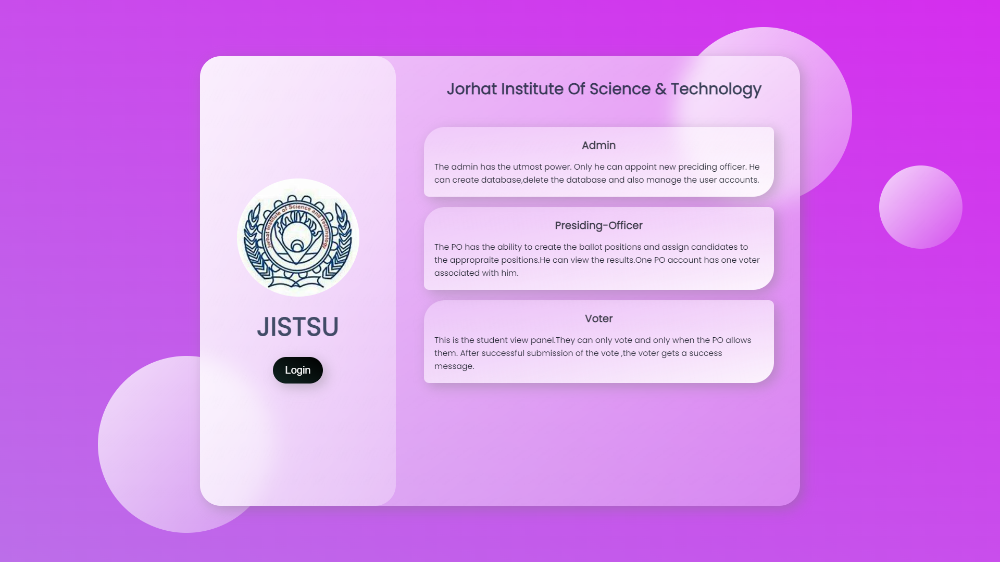
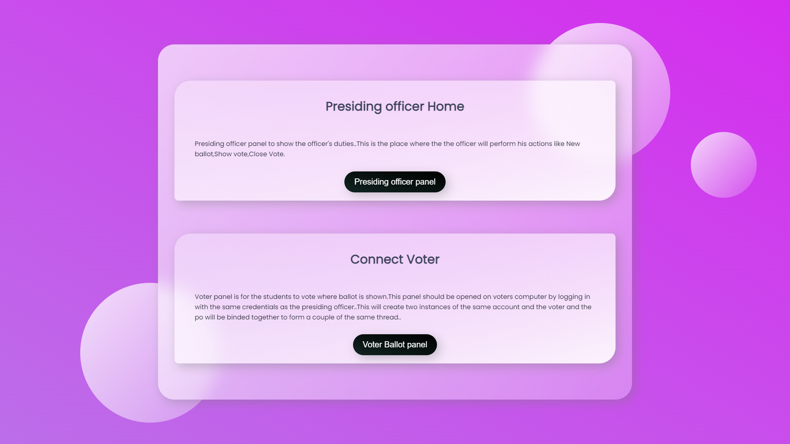
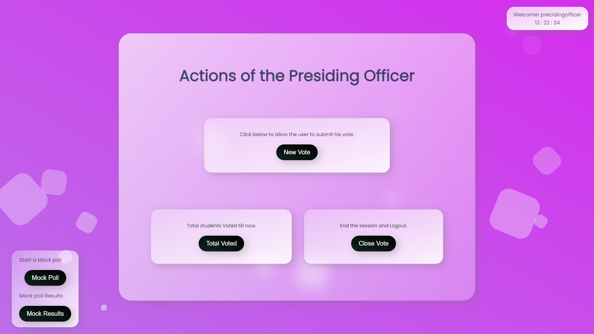
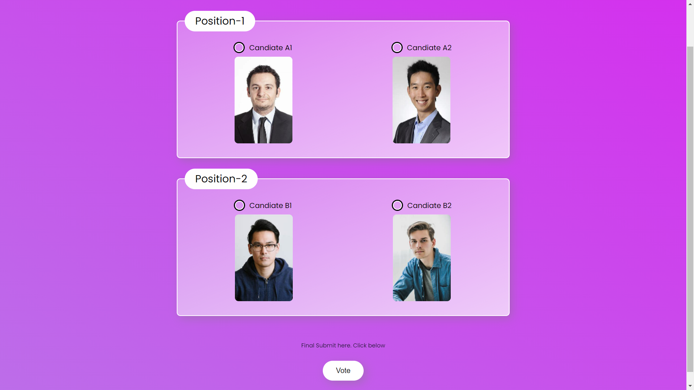
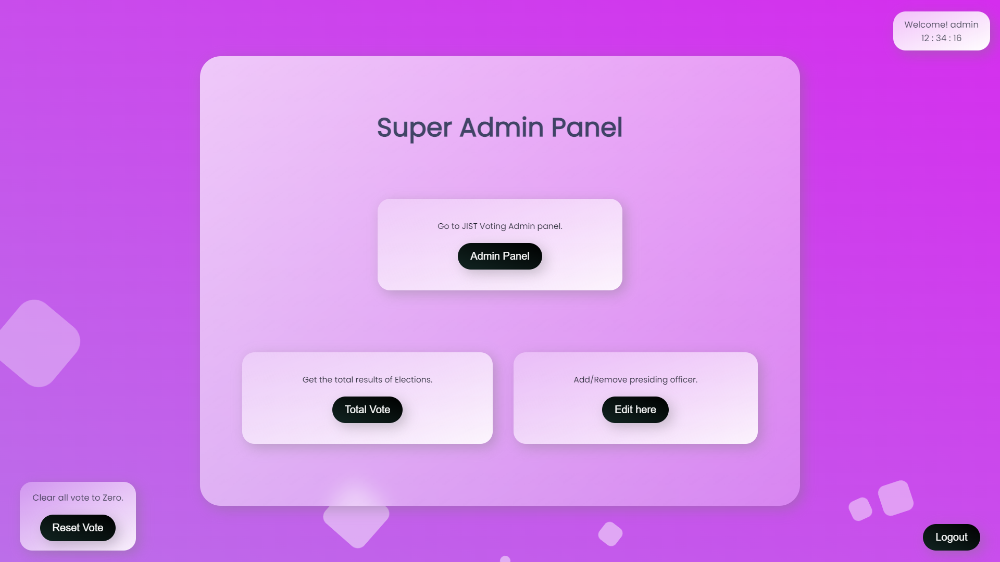
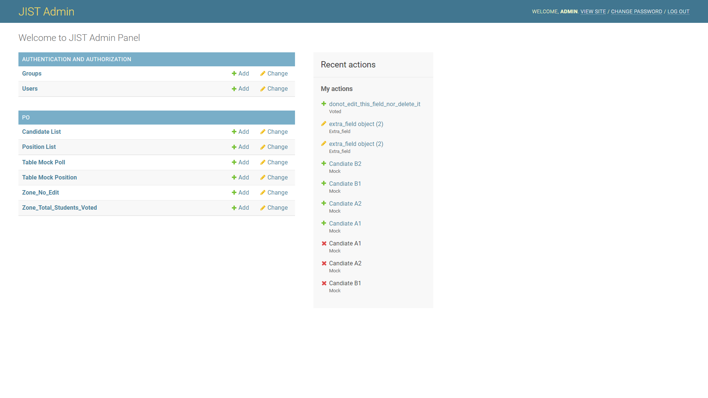

<div inline="block">

  
  
  
  
  
  
  
  
  
  
</div>

# Django_poll

This is the voting project Designed for JORHAT INSTITUTE OF SCIENCE AND TECHNOLOGY.
<div style="align:center">
 
</div>
 

##### ```Users```


>The Project consists of three type of users - Admin,Presiding_Officer & Voter/Student.


```Admin ```


>The Admin has all the Previlidges including creation,deletion,updation of the voting panel and also to add and remove Presiding_Officer.Only he can see the total votes or the results of the election. There is the facility to print the results after the elections are over.


```Presiding_officer```


>The Presiding_Officer can organize Mock-Poll(see the results of mock poll,delete the mock-poll table).He has the ability to see the total no of students that have voted.When the Presiding officer clicks the "New_vote" button on the presinding officer panel ,then only the voter can submit his vote.The presiding officer and the voter are connected by logging in with the same username and password provided by the admin on the two respective computers, and this creates two instances of the same user which are bounded to one session. Once the preciding officer clicks 'New_vote' ,the button disables and he has to wait for the voter to submit his vote. When the Voter submits his vote ,a success message is shown on the prciding officer panel after which the 'New_vote' button becomes active again and the officer can click this button again to allow the next voter to submit his vote. 


```Voter```

>Voter or the student has the only access to voting panel and after successful submission of the vote a successfull message is shown to the Voter and also a concurrent messsage is sent to the precinding officer to let him know that the user has successfully submitted his vote.Once he submits the vote the next voter has to wait for the preciding officer to click the 'New_vote' button.

_______________________________________________________________________________________________________________________________________________________________________
# Software Used
<div>
 
 </div>

The application is build with Django. The project uses no CSS frameworks, just plane CSS. It uses Pusher JS to provide realtime communication between the Preciding officer and the Voter. Also there are a variation of little javascript libraries here and there such as jQuery, Ajax etc. The Database it uses is the ~Sqlite3 which comes in packed with Django, Hence we are relieved from trouble of implementing our own database .  


_______________________________________________________________________________________________________________________________________________________________________
# Usage

#### To get it up and running quickly:
Make sure you have python3.1 or above installed on your machine.


### The easier method :


> Download the zip file by selecting the branch as master.


> Unzip it and move inside the Django_poll folder.


> Move inside the ballot folder.


> Now open the powershell or command prompt with the current ballot folder and type the bellow command.


```javascript
$ python3 manage.py runserver
```
This will start the server on 8000
> vist the below link in browser 
```javascript 
$ http://127.0.0.1:8000
 ```

Just one command and you are good to go, no need for any extra dependencies.


### or (other method)
> Copy the Below command
```javascript
$ git clone https://github.com/Hungryfoxz/Django_poll.git
```
This will create a folder named Django_poll into your current working directory.
> Now cd into the directory 
```javascript
$ cd Django_poll
```
Now you will see a directory tree something like this.
>##### ballot


>######    |+..../ballot


>######    |+..../po


>######    |+..../static


>######    |+..../templates


>######    |+..../db


>######    |+..../manage.py


>##### env


>##### .gitignore


>##### README.md


> Now cd into the ballot folder 

```javascript
$ cd ballot
```

Now once you are inside the ballot directory just type in the bellow command to start the development server.
> By default it will run on http://127.0.0.1:8000
```javascript
$ python3 manage.py runserver
```


### Default Credentials

Login to the admin panel with this url : 
### http://127.0.0.1:8000/admin


```username :```
> ##### admin


```password :```
> ##### admin


After you are successfully logged in , Go to the users table and add New user and select the previledges. Add new admin and password as your choice and give him the 'super-user(admin)' access and after the new 'super-user(admin)' is created remove the default superuser(amdin).
 To create new Preciding officer just follow the same procedure but don't give him the superuser(admin) access this time. You can add as many staff users as you like(just keep in mind that , you need to create only one superuser(admin)).


# Working :

#### ```Home/Index panel```


> On successfull Completion of the Server setup , You will be greeted with this page.


> CLick ```Login``` to go to the login panel.


<div style="align:center">
 
</div>


### ```Login panel```
> Enter the username/password to ```login```


> All the users have to ```login``` thorough this panel.

<div style="align:center">
 
</div>


### ```Officer/Voter connection establishment panel```

> On entering the Presiding officer username/password you will see this page .  Enter the same username/password on the voter computer too.


> Now click ```Presidig Officer panel``` to go to the presiding officer home on the ```officer``` computer.

> Click the ```Voter Ballot panel ``` to go to the ballot panel on the ```voter``` computer.

> This will connect the ```voter``` computer with the ```Officer``` computer.


<div style="align:center">
 
</div>


### ```Presiding officer home```

> Click ```New Vote``` to allow the voter to add vote.

> Click ```Total Voted``` to see the total number of students that have voted.

> On the left hand side you can Organize mock poll . ```Mock poll``` to start mock poll and ```Results``` to see the results.


<div style="align:center">
 
</div>


### ```Ballot/Voter panel```
> The voter can select his/her desired candidate and submit the ```vote```


<div style="align:center">
 
</div>

### ```Admin panel```
> On entering the admin username/password you will be greeted with this Super Admin panel.

> Click ```Admin panel``` will take you to the admin Database.

> Click ```Total vote ``` to see the results of the election.

> Click ```Edit here``` to add/remove new user.

> Click ```Reset Vote``` to clear all the votes from the Database and set to zero.

> Click ```Logout``` to end the session and exit.


<div style="align:center">
 
</div>

### ``` JISTSU Admin Database area```
> The Databse to control all the Tables from adding usrs to creating ballot.

>```Users``` --- It is the table to create new users including new admin.

>```Candidate List``` --- Add new candidate for the ballot here.

>```Positions List``` --- Add new positions according to the need of the elections.

>```Table Mock Poll``` --- Add Candidate in the mock table.


<div style="align:center">
 
</div>

_______________________________________________________________________________________________________________________________________________________________________
## Acknowledgments

This Project was made possible only through the efforts of [`chandanrajbongshi99`](https://github.com/chandanrajbongshi99). His vase knowledge of JavaScript libraries and instant problem solving capability made it extremely easy to tackle the various difficulities faced during the creation of the project . 

## See Also

- [`Django Documentation`](https://github.com/noffle/common-readme)
- [`StackOverflow`](https://stackoverflow.com)
- [`Pusher JS`](https://pusher.com/docs/channels/getting_started/javascript)

## License

Not Licenced.
 
